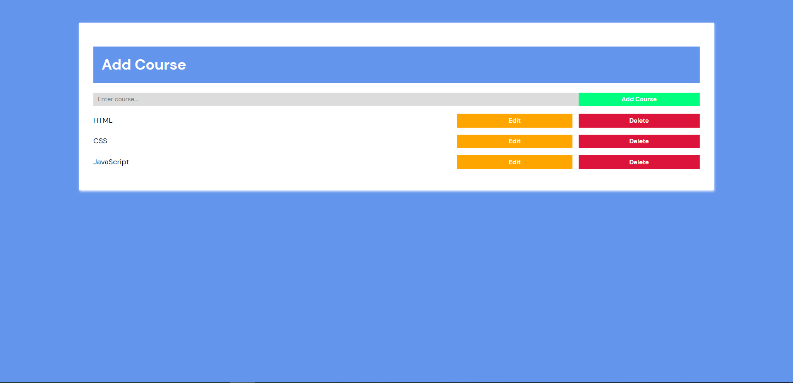

# CRUD-App

## Table of Contents
- [Installation](#installation)
- [Features](#features)

## Installation

To install and run this project, follow these steps:

1. Clone the repository:
   git clone https://github.com/Ska9/CRUD-App.git
   
2. cd CRUD-App
  
3. npm install

4. npm start

## Features

- Create new items and add them to the app.
- Read and view a list of existing items.
- Update and edit the details of each item.
- Delete items from the app.
